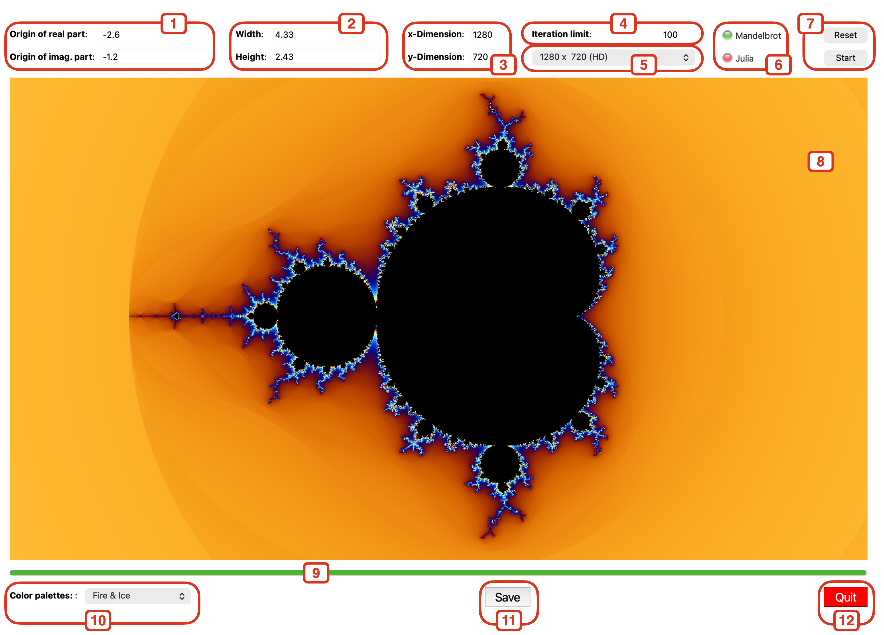

# qtFractals
App to calculate fractals with Python &amp; Qt

## Introduction
This app calculates fractal sets. It provides a few features like

- "zoom-in" in a fractal via cursor,
- "zoom-in" / "zoom-out" via specific input coordinates,
- define the area of the calculated set,
- define the value of iteration for the fractal formula,
- providing pre-defined drawing dimensions,
- switching from Mandelbrot set to Julia set,
- saving the calculated result in a file,
- change the color palette (providing pre-defined color palettes)
- ...

The app is written in Python3 and PySide6.

This program is free software: you can redistribute it and/or modify
it under the terms of the
[Apache 2.0 license](http://www.apache.org/licenses/LICENSE-2.0) as
published.

## Main window

In this section I describe the main window and its controls:

1.  **Origin coordinates of the complex area** separated by the real part
    and complex part.
2.  **Width and height of the complex area**
3.  **Width and height of the drawing area (resolution)**. Additionally to the
    manual input you may select a few predefined resolutions. Relevant for the
    next calculation are the values in the input/edit fields. Take care that
    the ratio of the complex area and the drawing area have the same value!
    (Tip: defining areas to zoom in with the cursor takes into account the
    ratio by default.)
4.  **Itration limit** for the fractal formula. Good values are from 100 to
    1000. The bigger the value, the time consuming the calculation (more
    detailled results).
5.  **Fractal indicator** that shows what kind of set (Mandelbrot or Julia)
    currently is active.
6.  **"Reset" and "Start" button**: The "Reset" button resets all values to
    the values at the initial phase of the app. The "Start" button starts a
    new calculation with the values in (1), (2), (3), (4), and (5).
7.  **The drawing area**
8.  **The progress bar** indicates how much of the fractal has been calculated.
    The fractal set will be shown at the end of the progrss bar.
9. **Color palettes** provides a few predefined color palettes. As soon as
   you change the current color palette the current fractal set will be
   recalculated with the new selected colours.
10. **"Save" button** to save the current fractal set in a file.
11. **"Quit" button** to exit the application.

## Mouse actions

### Julia set

You may switch from the Mandelbrot set to the Julia set by pressing [CTRL]+LMB
(Windows/Linux) or [CMD]+LMB (Apple) on any point of the calculated set.
Immediatly the calculation starts for the Julia set at this point. Of course
you may zoom-in in the Julia set, too. The fractal indicator (see item 5 above)
switches accordingly.